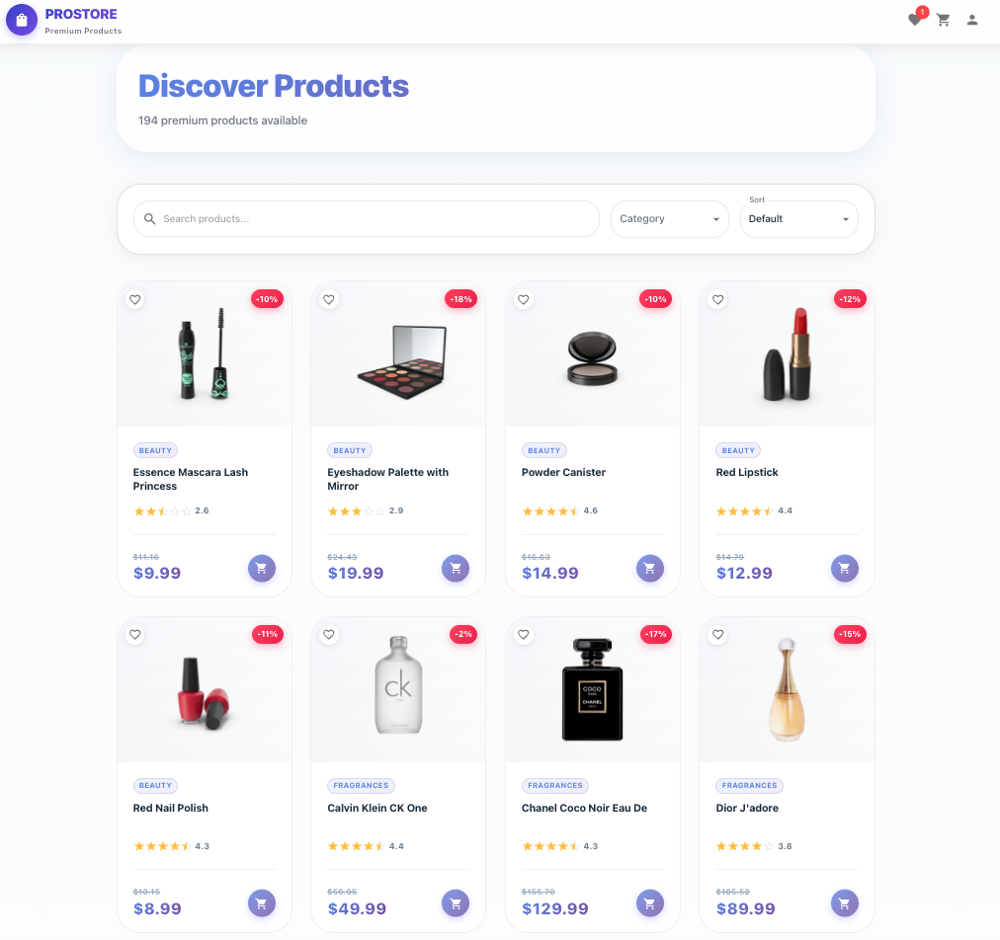
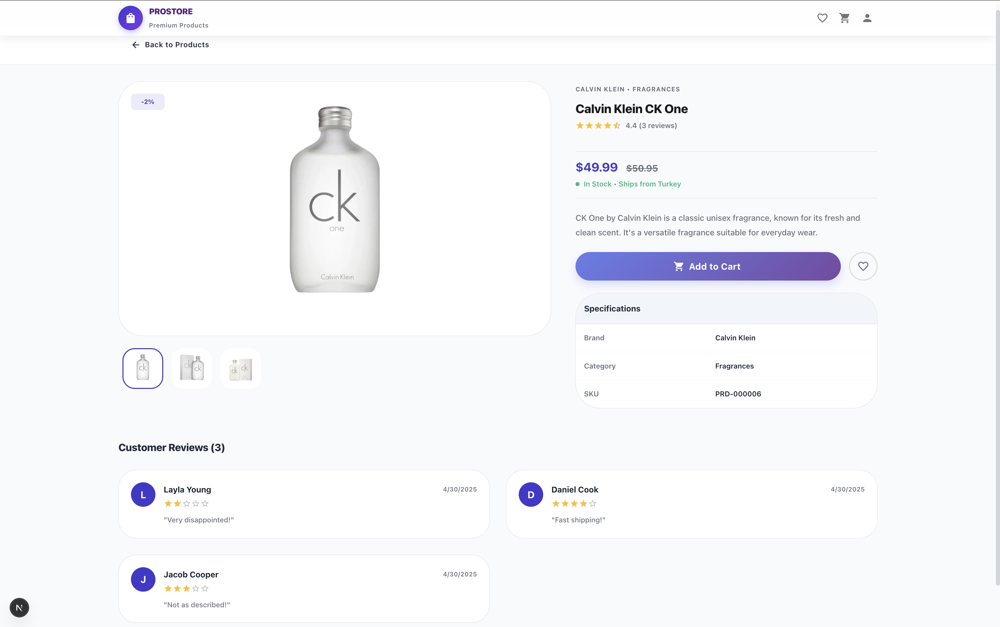
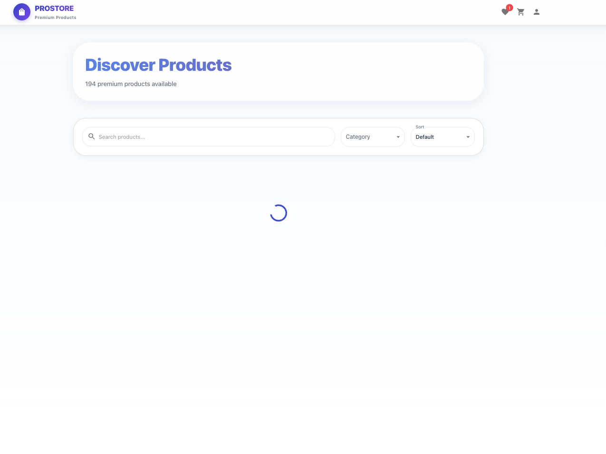
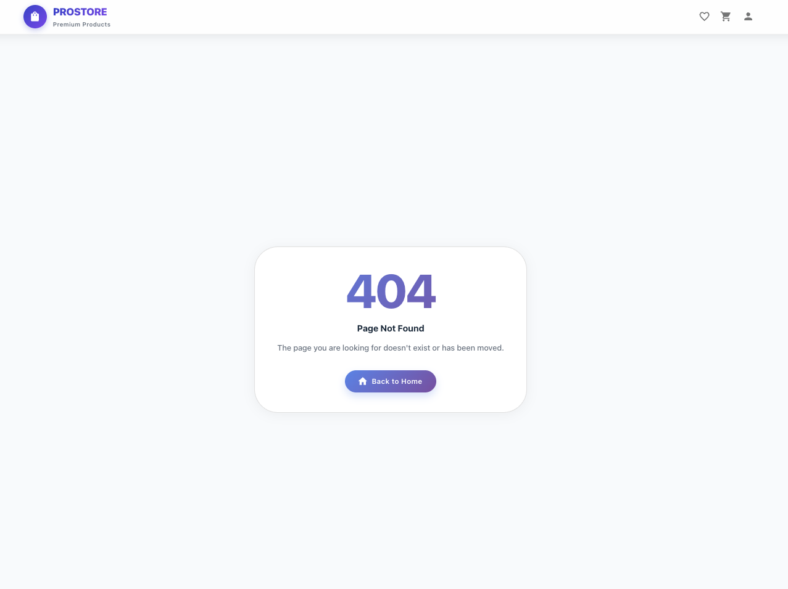
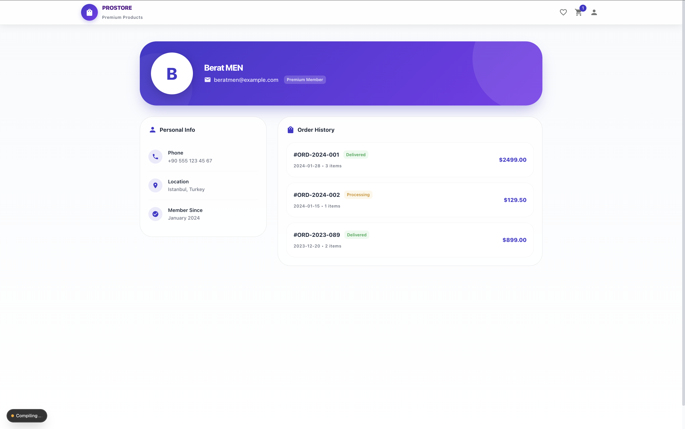

# Product Dashboard

A modern, full-featured e-commerce product dashboard built with **Next.js 16**, **React 19**, **Material UI v7**, **Redux Toolkit**, and **TypeScript**. This application showcases advanced frontend development practices including SSR/CSR rendering strategies, feature-based architecture, state management, shopping cart functionality, and a premium glassmorphism UI design.

## 🎥 Quick Look

<video src="https://github.com/user-attachments/assets/63f34d0c-8e3f-42bb-b6fd-9b8c8bc8a6e6" controls width="100%"></video>

_(If the video doesn't play, you can [view it here](https://github.com/user-attachments/assets/63f34d0c-8e3f-42bb-b6fd-9b8c8bc8a6e6))_

## 📸 Screenshots

Please add the following images to the `screenshots` folder in the root directory.

### Product List Page



_**Key Features:**_

- **Dynamic Filtering:** Filter products by category with URL synchronization for shareability.
- **Smart Search:** Debounced search input (500ms) to reduce API calls and improve performance.
- **Stock Validation:** Out-of-stock items are visually distinguished (grayscale) and non-interactive.
- **Tech:** Uses `useSearchParams` for state persistence and Server Components for initial data fetching.

### Product Detail Page



_**Key Features:**_

- **Rich Media Gallery:** Interactive image slider with thumbnail navigation.
- **Persisted State:** Add-to-cart functionality with Redux Toolkit and LocalStorage persistence.
- **Responsive Design:** Adaptive layout using MUI Grid v2 (`size` prop) for different screen sizes.
- **Feedback:** Toast notifications upon adding items to the cart or favorites.

### Loading State



_**Key Features:**_

- **Skeleton UI:** Mimics the actual content layout to reduce perceived waiting time.
- **Prevention:** Prevents Layout Shift (CLS) by reserving space for incoming data.
- **Hybrid Approach:** Used during both initial SSR hydration and subsequent client-side navigation.

### Error State


_**Key Features:**_

- **Global Handling:** Centralized error boundary (`error.tsx`) catching both runtime and API errors.
- **Recovery:** "Try Again" button executes `reset()` to attempt re-rendering the segment without a full page reload.
- **Visuals:** Custom designed error illustrations matching the app's glassmorphism theme.

### Not Found State



_**Key Features:**_

- **Routing:** Catches all unmatched routes (`[...catchAll]`) and displays a helpful 404 screen.
- **Navigation:** Provides a direct link back to the dashboard to keep users within the app flow.
- **Consistency:** Maintains the same layout and header visibility even on non-existent pages.

### Profile Page



**_Key Features:_**

- **Modular Architecture:** Implemented as a standalone feature module (`src/features/profile`).
- **Data Visualization:** Displays mock order history and status chips (Delivered/Processing) with conditional styling.
- **Modern UI:** Utilizes Material UI `Avatar`, `Paper`, and `Grid` components with a custom gradient banner.
- **Layout:** Responsive 2-column layout separating personal info from transaction logs.

## 🚀 Features

### 🛍️ Core E-Commerce

- **Smart Shopping Cart**: Real-time total calculation, quantity management, and persistent storage using LocalStorage.
- **Favorites System**: Save products for later with quick access via a dedicated side drawer.
- **Product Discovery**: Advanced filtering by category, dynamic sorting (price/rating), and instant search with debouncing.
- **Product Details**: Comprehensive views with image galleries, specifications, and customer reviews.

### 🎨 User Experience

- **Premium UI**: Modern glassmorphism design with backdrop blurs, gradient accents, and smooth transitions.
- **Responsive Layout**: Fully adaptive design that works seamlessly on mobile, tablet, and desktop devices.
- **Interactive Feedback**: Loading skeletons, toast notifications, and user-friendly error states.

## 🛠 Tech Stack

| Category             | Technologies            |
| -------------------- | ----------------------- |
| **Framework**        | Next.js 16 (App Router) |
| **Core**             | React 19                |
| **Language**         | TypeScript              |
| **State Management** | Redux Toolkit           |
| **UI Library**       | Material UI v7          |
| **HTTP Client**      | Axios                   |
| **Styling**          | MUI System + Emotion    |
| **Persistence**      | LocalStorage API        |
| **DevOps**           | Docker                  |
| **Linting**          | ESLint, Prettier        |

## 📦 Project Architecture

The project follows a **Feature-Based Architecture** to ensure scalability and modularity.

```
src/
├── app/                      # Next.js App Router
│   ├── products/
│   │   ├── [id]/
│   │   │   └── page.tsx      # Product detail (SSR)
│   │   └── page.tsx          # Product list (SSR)
│   ├── layout.tsx            # Root layout with providers
│   └── page.tsx              # Home page
│
├── components/               # Shared / Layout Components
│   └── layout/
│       └── Navigation.tsx    # App header with badges
│
├── features/                 # Feature-based Modules
│   ├── cart/
│   │   ├── components/       # e.g., CartDrawer.tsx
│   │   ├── store/            # cartSlice.ts
│   │   └── utils/            # storage.ts
│   ├── favorites/
│   │   ├── components/       # e.g., FavoritesDrawer.tsx
│   │   ├── store/            # favoritesSlice.ts
│   │   └── utils/            # storage.ts
│   └── products/
│       ├── components/       # ProductsView.tsx, ProductDetailView.tsx
│       ├── services/         # productService.ts
│       ├── store/            # productSlice.ts
│       └── types/            # Type definitions
│
├── store/                    # Global Store Configuration
│   ├── hooks.ts              # Typed Redux hooks
│   └── store.ts              # Store configuration
│
├── lib/
│   └── axios.ts              # Axios instance + interceptors
│
└── theme.ts                  # MUI theme customization
```

## 🏁 Getting Started

### Prerequisites

- Node.js 18+
- npm or yarn

### Installation

1. **Clone the repository**

   ```bash
   git clone <repository-url>
   cd product-dashboard-task
   ```

2. **Install dependencies**

   ```bash
   npm install
   ```

3. **Run the development server**

   ```bash
   npm run dev
   ```

4. **Open your browser**
   Navigate to [http://localhost:3000](http://localhost:3000)

### 🐳 Running with Docker

This project is fully containerized. You can run it with a single command:

1. **Build and Run**

   ```bash
   docker-compose up --build
   ```

2. **Access the App**
   Open [http://localhost:3000](http://localhost:3000)

3. **Stop the Container**
   Press `Ctrl + C` or run:
   ```bash
   docker-compose down
   ```

### Available Scripts

```bash
npm run dev      # Start development server
npm run build    # Create production build
npm run start    # Start production server
npm run lint     # Run ESLint
```

## 🏗 Technical Deep Dive

### Hybrid Rendering Strategy

- **Server-Side Rendering (SSR)**: Used for the Product List and Product Detail pages to ensure optimal SEO and fast initial load times (First Contentful Paint).
- **Client-Side Rendering (CSR)**: Used for interactive components like the Cart, Favorites drawer, and dynamic filtering to provide a snappy, app-like experience.

### State Management (Redux Toolkit)

The application state is managed using Redux Toolkit with a normalized structure:

- **Products Slice**: Handles fetching, caching, and state of product data.
- **Cart & Favorites Slices**: Manage user selections with automatic LocalStorage synchronization.
- **UI Slice**: Controls global UI state like search queries and pagination.

### Design System

A custom Material UI theme is implemented with:

- **Typography**: Inter font family with carefully selected weights.
- **Palette**: A vibrant color scheme featuring purple-blue gradients (`#667eea` → `#764ba2`) and functional status colors.
- **Glassmorphism**: Extensive use of `backdrop-filter` and semi-transparent backgrounds for a modern aesthetic.

## 🚀 Future Enhancements

- [x] User Authentication & Profiles (Mock Implementation)
- [ ] Payment Gateway Integration
- [ ] Order History & Tracking
- [ ] Dark Mode Support
- [ ] Comparison Tool

## 📝 License

This project is created as a technical assessment and is available for review purposes.

## 👤 Author

**Berat MEN**

- GitHub: [@beratmen](https://github.com/beratmen)

## 🙏 Acknowledgments

- [DummyJSON API](https://dummyjson.com/) for providing the product data
- Material UI team for the excellent component library
- Next.js team for the powerful framework

---

**Built with ❤️ using Next.js 16, React 19, and Redux Toolkit**
